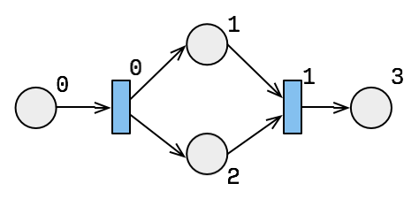
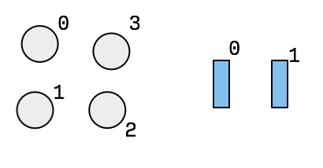
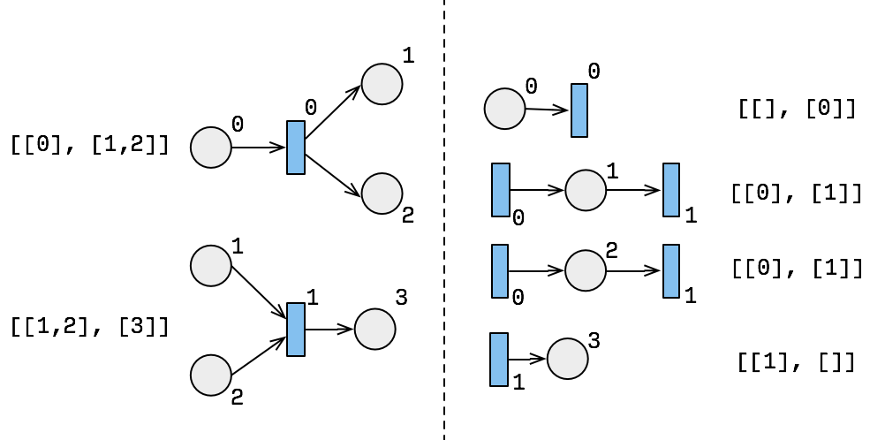
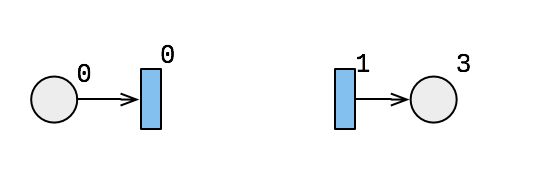

# Minimalistic Petri Net Representation

We propose a very minimalistic way to represent a finite Petri net.
See `tbpt`

## API by example

Suppose we have this Petri Net


<!--
            ◯₁
          ↗   ↘
◯₀ ⟶ █₀        █₁ ⟶ ◯₃
          ↘   ↗
            ◯₂
-->

We feed it's JSON representation (see `tbpt`) to `StateNet`.

```js
const p = StateNet([ /* network specification */
    [[0],[1,2]],
    [[1,2],[3]]
])
```

### Bi-partite graph



We get a graph with two partitions, `places()` and `transitions()`.

```js
p.places() //=> 4
p.transitions() //=> 2
```


### Adjacent vertices



We can get the adjacent transitions of a place of visa versa as follows:

```js
p.place(0) //=> [[], [0]]
p.place(1) //=> [[0], [1]]
p.place(2) //=> [[0], [1]]
p.place(3) //=> [[1], []]
t.transition(0) //=> [[0],[1,2]]
t.transition(1) //=> [[1,2], [3]]
```

We can get the whole net as viewed from the opposite partition,

```js
p.dual() === R.map(i => p.place(i), p.places())
```

### Initial / Terminal



Of each partition, there are special vertices, namely the ones with only
incoming or only outgoing arcs.

```js
p.creators() //=> list of transitions with only outgoing arcs
p.annihilators() //=> list of terminal transitions with only incoming arcs
p.receivers() //=> list of places with only outgoing arcs
p.transmitters() //=> list of event emitting places only incoming arcs
```
